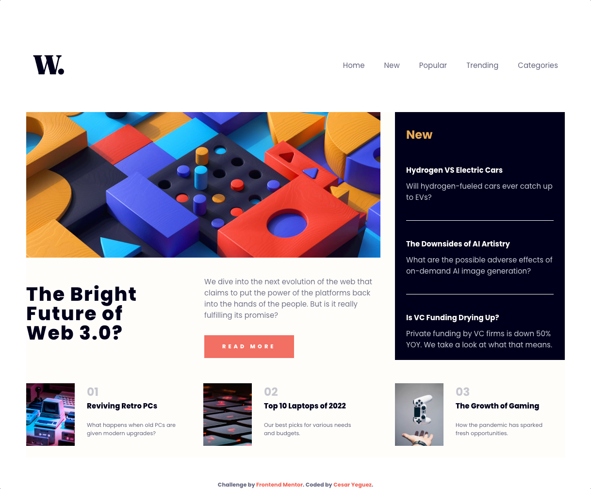

# Frontend Mentor - News homepage solution

This is a solution to the [News homepage challenge on Frontend Mentor](https://www.frontendmentor.io/challenges/news-homepage-H6SWTa1MFl). Frontend Mentor challenges help you improve your coding skills by building realistic projects.

## Table of contents

- [Overview](#overview)
  - [The challenge](#the-challenge)
  - [Screenshot](#screenshot)
  - [Links](#links)
- [My process](#my-process)
  - [Built with](#built-with)
  - [What I learned](#what-i-learned)
- [Author](#author)

**Note: Delete this note and update the table of contents based on what sections you keep.**

## Overview

Hello, my name is César, I decided to continue doing the Frontend Mentor challenges.

### The challenge

This challenge consists of building a web page with its respective navbar, it changes and adjusts depending on the device, the main content changes the location of the elements depending on the screen.

### Screenshot

### Links

- Solution URL: [Add solution URL here](https://cyeguez.github.io/news-homepage-main/)

## My process

I started the project by assigning the folder architectures, I decided to add sass to the project, then I assigned the tags to the html, I set the variables and colors in the sass, then I started styling the project in mobile first mode, then I added the styles in mediaquery for desktop screen in mediaquirys, and in the end I made the intersections of the menu buttons with js.

### Built with

- Semantic HTML5 markup
- BEM
- SASS
- Flexbox
- CSS Grid
- Mobile-first workflow

### What I learned

I had to go over the nth-child() property to generate a grid and assign it to the location I needed.

`&>div:nth-child(1){
grid-column: 1/2;

      }`

I

## Author

- Website - [César Yeguez](https://cyeguez.github.io/news-homepage-main/)
- Frontend Mentor - [Cesar Yeguez](https://github.com/cyeguez)
